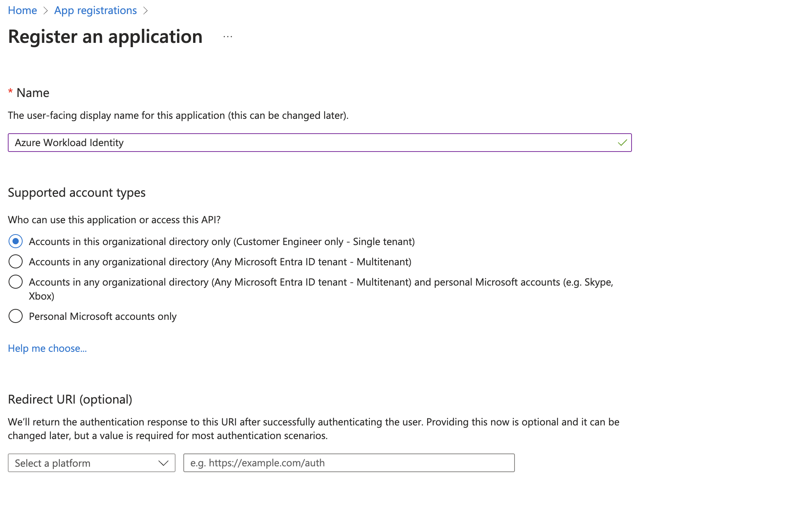
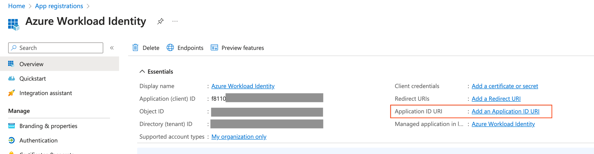
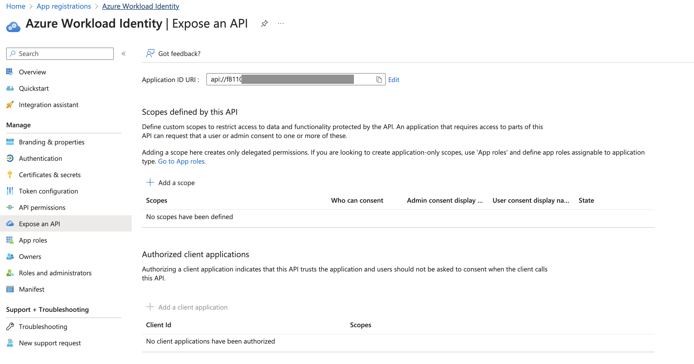
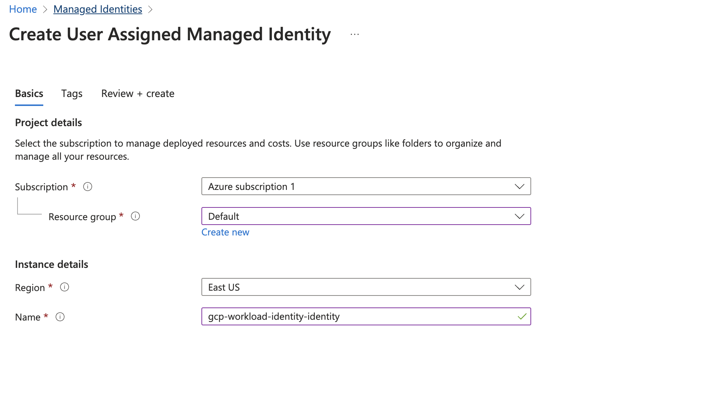
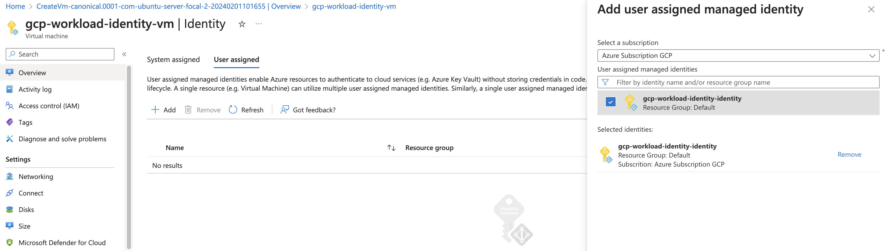
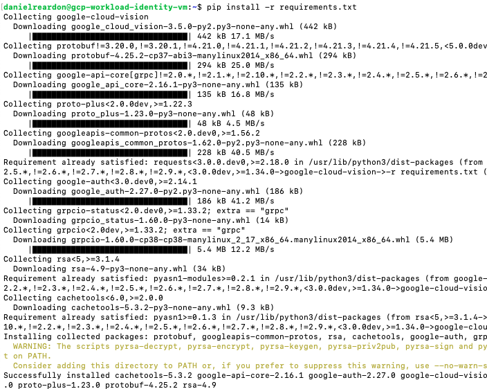
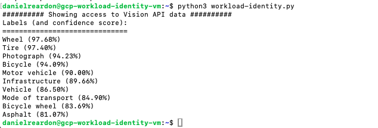

# Azure Workload Identity Federation

This is the Azure portion of a multi project set of examples for configuring Google Cloud Workload Identity Federation. For further information on this set-up please refer to Google's documentation here: https://cloud.google.com/iam/docs/configuring-workload-identity-federation#azure_3

## Google Disclaimer
This is not an officially supported Google product

## Table of Contents
1. [Prerequisites](https://github.com/dreardon/workload-identity-azure#prerequisites)
1. [Google Service Account and Identity Pool](https://github.com/dreardon/workload-identity-azure#create-a-google-service-account-and-identity-pool)
1. [Create and AzureAD Application](https://github.com/dreardon/workload-identity-azure#create-an-azure-ad-application)
1. [Associate Managed Identity With Instance](https://github.com/dreardon/workload-identity-azure#associate-managed-identity-with-an-instance)
1. [Connect Identity Pool to Azure](https://github.com/dreardon/workload-identity-azure#connect-identity-pool-to-azure)
1. [Validate Workload Identity Pool](https://github.com/dreardon/workload-identity-azure#validate-inside-of-an-azure-virtual-machine)

## Prerequisites
<ul type="square"><li>An existing Google Project, you'll need to reference PROJECT_ID later in this setup</li>
<li>Enabled services</li>

```
gcloud services enable iamcredentials.googleapis.com
gcloud services enable vision.googleapis.com
```
</ul>

## Create a Google Service Account and Identity Pool
```
export PROJECT_ID=[Google Project ID]
export PROJECT_NUMBER=[Google Project Number]
export SERVICE_ACCOUNT=[Google Service Account Name] #New Service Account for Workload Identity
export WORKLOAD_IDENTITY_POOL=[Workload Identity Pool] #New Workload Identity Pool Name

gcloud config set project $PROJECT_ID

gcloud iam service-accounts create $SERVICE_ACCOUNT \
    --display-name="Azure Workload Identity SA"

gcloud projects add-iam-policy-binding $PROJECT_ID \
    --member="serviceAccount:$SERVICE_ACCOUNT@$PROJECT_ID.iam.gserviceaccount.com" \
    --role="roles/visionai.admin"

gcloud iam workload-identity-pools create $WORKLOAD_IDENTITY_POOL \
    --location="global" \
--description="Workload Identity Pool for Azure" \
--display-name="Azure Workload Pool"

gcloud iam service-accounts add-iam-policy-binding $SERVICE_ACCOUNT@$PROJECT_ID.iam.gserviceaccount.com \
    --role="roles/iam.workloadIdentityUser" \
    --member="principalSet://iam.googleapis.com/projects/$PROJECT_NUMBER/locations/global/workloadIdentityPools/$WORKLOAD_IDENTITY_POOL/*"
```
## Create an Azure AD Application
The linked [documentation](https://cloud.google.com/iam/docs/configuring-workload-identity-federation#prepare) describes how to create an Azure AD Application and a Managed Identity which will make the call to the Google Cloud API
Following the documentation, and as shown in the images below, you'll find yourself with:
- An APPLICATION_ID_URI which I later call "AUDIENCE"
- A MANAGED_IDENTITY_OBJECT_ID which will end up being the "sub" claim when requesting tokens





## Associate Managed Identity with an Instance



## Connect Identity Pool to Azure
After completing these steps, there will be a generated client-config.json file which will be used by the example code to covert the temporary Okta credentials to short-lived Google credentials.
```
export PROJECT_ID=[Google Project ID]
export PROJECT_NUMBER=[Google Project Number]
export SERVICE_ACCOUNT=[Google Service Account Name]
export WORKLOAD_IDENTITY_POOL=[Workload Identity Pool]
export WORKLOAD_PROVIDER=[Workload Identity Provider] #New Workload Provider Name
export AUDIENCE=[Audience URL] #From Azure Audience Configuration (e.g. api://default or your custom value)
export ISSUER=[ISSUER] #From Azure Issuer Configuration, also referenced in documentation as "APPLICATION_ID_URI"

gcloud iam workload-identity-pools providers create-oidc $WORKLOAD_PROVIDER \
    --location="global" \
    --workload-identity-pool="$WORKLOAD_IDENTITY_POOL" \
    --issuer-uri="$ISSUER" \
    --allowed-audiences="$AUDIENCE" \
    --attribute-mapping=google.subject=assertion.sub

gcloud iam workload-identity-pools create-cred-config \
    projects/$PROJECT_NUMBER/locations/global/workloadIdentityPools/$WORKLOAD_IDENTITY_POOL/providers/$WORKLOAD_PROVIDER \
    --service-account="$SERVICE_ACCOUNT@$PROJECT_ID.iam.gserviceaccount.com" \
    --service-account-token-lifetime-seconds=3600 \
    --azure \
    --app-id-uri $AUDIENCE \
    --output-file=client-config.json
```

## Validate Inside of an Azure Virtual Machine



### For More Detail
* https://cloud.google.com/iam/docs/configuring-workload-identity-federation#azure_3
* https://cloud.google.com/sdk/gcloud/reference/iam/workload-identity-pools/create-cred-config
